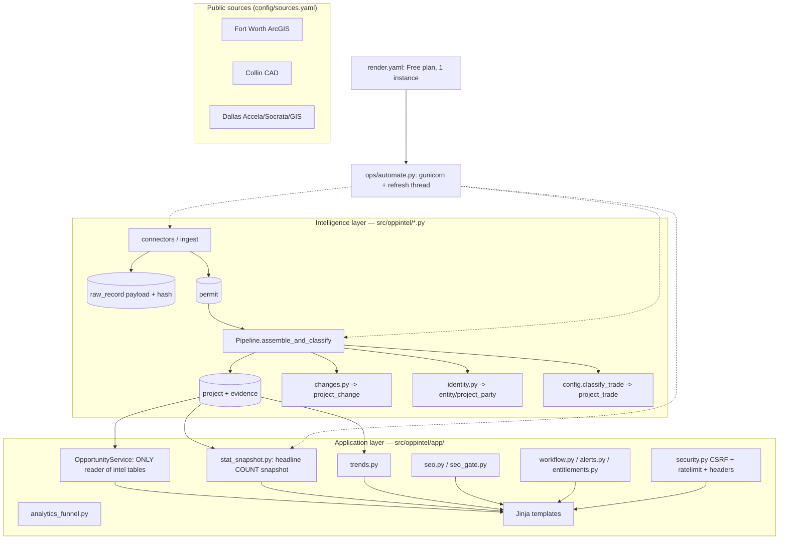

# BuildScope — Read-Only Technical Audit (2026-10-09)

**Auditor:** OpenHands (Principal SWE / Staff UI Engineer)
**Commit:** `main` @ `8f2e8ae` (WP3 `wp3-visual` merged this session)
**Live:** https://buildscope-xppz.onrender.com
**Rule:** Read-only. All DB reads against `/tmp` copies (`/tmp/demo_buildscope.db`, `/tmp/ro.db`). No schema change, no data deletion.

> Two datasets are referenced:
> - **LOCAL** = `/tmp/demo_buildscope.db`, byte-copy of the shipped `data/oppintel.db` (28,942,336 bytes): 1,261 projects / 4,190 permits. Reproducible fixture.
> - **LIVE** = Render instance (`/healthz` → `/opt/render/project/src/data/oppintel.db`): 1,789 projects / 6,195 permits.
> Founder-quoted numbers ("175/12/6,175", "253/26/11,966") are LIVE-era; LOCAL proves the code paths.

---

## 1. Executive summary

BuildScope is a well-engineered Flask + SQLite intelligence pipeline with a disciplined "never invent a value" contract, real schema migrations, a tested security layer, and **0 axe-core violations on all 16 public routes**. The core weakness is **truth drift at the presentation boundary**: at least four independent headline-count engines and no enforced reconciliation, so home, `/healthz`, Trends and Analytics print different numbers for the same word. Live home advertises "170 public projects" while live `/healthz` in the same second reports "projects: 1789" — a 10× split a buyer will notice. The catalog is also thin where it sells: **every company is an Owner; GC and Architect are 0 dataset-wide**, and 88.6% of titles are raw source shout-caps cleaned only at render time. The deploy is currently stalled (no release marker ~25 min after push).

| Dimension | /10 | Rationale |
|---|---|---|
| Data integrity | **4** | 4+ disagreeing headline counts; 2 future permits; 2,286 orphan permits (54.6%). |
| UI / design | **6** | Real 82-token system; 348 inline `style=` and 11 `!important` bypass it. |
| Mobile | **6** | 0 overflow anywhere; 200 sub-44px tap targets. |
| Performance | **7** | ~9 KB HTML, ~110 KB assets, 4–5 requests, server pagination. |
| Accessibility | **8** | axe 0/16 routes; only small-target/focus-size residue. |
| Security | **8** | CSP+nonce, CSRF, rate limit, PBKDF2, secure cookies, no secrets tracked; 1 auth-throttle gap. |
| SEO | **6** | Canonicals/sitemap(48)/JSON-LD/robots good; meta bakes volatile counts. |
| Product completeness | **5** | Alerts/watch/pipeline/notes/tags exist; no exports/saved-searches/email; GC-architect absent. |
| Code quality | **7** | Layered, documented, 1,276 tests green; duplicated headline SQL is the smell. |
| Ops | **5** | Good health endpoint; Free plan resets data; deploy stalled; no monitoring. |
| **Overall** | **6.2** | Strong bones, weak truth-consistency and data depth. |

---

## 2. Architecture overview



**Stack:** Python 3.13.15 · Flask 3 · Jinja2 · SQLite (FTS5 search) · gunicorn (2 workers × 4 threads) · vendored deps in `vendor/python/`. No frontend framework is served — the React/Vite stub (`src/App.tsx`) renders an empty `<div>` and is off the serving path.

**Start/deploy:** `bash ops/start.sh` → foreground gunicorn + in-process refresh loop (`ops/automate.py`, `REFRESH_SECONDS=21600`). `render.yaml` = Free plan, `autoDeploy: true`, `healthCheckPath: /healthz`, no disk (data resets per deploy).

**Tests:** `python -m pytest tests/ -q` → **1,276 passed in 265.62s**.

---

## 3. Findings table

| ID | Severity | Area | Finding | Evidence (path:line / command) | Root cause | Recommended fix | Effort |
|---|---|---|---|---|---|---|---|
| F-01 | **Critical** | Data | Home meta/headline "170 public projects" vs live `/healthz` "projects: 1789" — same word, same second, 10× apart | `curl /` → `meta name=description …170…`; `curl /healthz` → `"projects":1789` | `/healthz` reads `metrics["projects_total"]`; home/SEO read `metrics["projects_public"]` (`stat_snapshot.py:103` vs `:227`); both surfaced as "projects" | Health must report `projects_public` under the same key the site uses, or label the two distinctly ("all assembled" vs "public") | S |
| F-02 | **High** | Data | At least 4 independent headline-count engines, no reconciliation | `stat_snapshot.compute_metrics` (`stat_snapshot.py:88`), `trends.build_trend_report` (`trends.py:360+`), `coverage_summary` (live `/healthz` `coverage.records=6162`), analytics | Counts computed in 4 places over different predicates (`public_where` vs `p.trade=?` vs source `permit`) | Make one module the sole authority; others call it; add a cross-page equality test | M |
| F-03 | **High** | Data | Trends "permit records" (11,906) ≠ Home "Permit records" (11,966) | `trends.py:410` counts `permit` joined via `project_permit` for one trade; `stat_snapshot.py:167` `permit_records_all = COUNT(*) FROM permit` | Two different "record" definitions, one label | Rename Trends metric to "Trade-linked permits" + inline definition; or unify | S |
| F-04 | **High** | Data | "533 projects with a detected change" exceeds total commercial projects (253) | `trends.py:500` counts `project_change WHERE change_kind<>'new_project'` over **all** assembled projects; LOCAL only `new_project` rows (1,261) so local changes=0 | Numerator and denominator from different populations | Scope `projects_changed` to the public predicate, or state the wider basis | M |
| F-05 | **Med** | Data | "28 strong mechanical evidence" vs Home "26" vs "212 classified trade scope" | `trends.py:578` `tier IN (1,2)` (LOCAL=8); `stat_snapshot.py:112` `evidence_clause` (LOCAL=8); `trends.py:455` any `project_trade` row (LOCAL=970) | Three scopes, three labels | Publish a definitions legend; label every figure with its scope | S |
| F-06 | **Med** | Data | Future-dated permits: 2 rows `permit_date > 2026-10-09` (e.g. `2026-12-19`, `2026-12-02`) | `SELECT count(*) FROM permit WHERE permit_date > '2026-10-09'` → **2**; examples `25-04076` (Plano), `25-005249` (Celina), source `collin_cad_permits` | Dates parsed verbatim; no upper bound at ingest | Clamp/flag at normalize; `quality.py` should count them | S |
| F-07 | **Med** | Data | 2,286 / 4,190 permit rows (54.6%) orphaned (no `project_permit`) | `SELECT count(*) FROM permit pm WHERE NOT EXISTS(SELECT 1 FROM project_permit pp WHERE pp.permit_id=pm.id)` → **2,286** | Non-commercial/out-of-window rows deliberately unlinked; 1,904 linked | Surface "landed vs linked vs dropped" (funnel exists at `stat_snapshot.py:175`) | S |
| F-08 | **High** | Data/UX | Every company is an Owner; GC and Architect are 0 | `role_counts()` → `{'owner': 99}`; `project.general_contractor/architect/developer` all **0** non-null | Sources publish owner only; nothing for `identity.py` to resolve | Ingest a GC/architect source, or stop implying they exist (partly fixed by M5) | L |
| F-09 | **Med** | UI | 88.6% of titles raw ALL-CAPS at rest (1,117/1,261) | `SELECT count(*) … project_name=upper(project_name)` → 1,117; project 560 `"2 Story Restaurant … It is16,297 SF"` | Cleanup render-only (`clean_title` filter, 8 templates); stored value unchanged | Persist `display_name` at assemble so API/JSON/export also get clean titles | M |
| F-10 | **High** | Mobile | 200 interactive elements below 44 px tall on mobile | `audit/capture_wp3.py` tap probe → 200; breadcrumbs/footer 15 px, `src-url` 18 px | Body/footer link styles lack min-height | `min-height:44px` (or padding) on nav/footer/inline links ≤820px | S |
| F-11 | **Med** | UI | Tokens exist but bypassed: 348 inline `style=`, 11 `!important` | `grep -rho 'style="' templates | wc -l` → 348; `grep -c '!important' app.css` → 11 | Ad-hoc inline styles; e.g. `opportunity_card.html:38` `style="color:var(--accent-light)"` | Move inline styles to utility classes; audit the 11 `!important` | M |
| F-12 | **Low** | UI | No enforced type ramp — 14 distinct `font-size` values | `grep font-size app.css | sort | uniq -c` → 0.72–1.85rem, 14 steps | No type-scale tokens | Define `--fs-*` tokens and replace | S |
| F-13 | **Med** | Data/UI | 15 of 20 cards show a missing-facts note; 8 miss ≥2 of {value, sqft} | LIVE `/opportunities`: 15/20 missing, 8 with ≥2 | Source coverage gap, honestly surfaced | OK; add a per-source coverage badge showing *why* | S |
| F-14 | **High** | SEO | Meta description bakes volatile counts ("170 … 10 …") into `<meta>`/OG/Twitter | `curl /` → description text; generated `seo.py:86` from `stats` | Counts interpolated at render; drift as data changes | Qualitative text, or date-stamp the figure | S |
| F-15 | **Med** | Product | No exports (CSV/PDF), no saved searches | `grep -n "csv|export|download" main.py` → **none**; `/saved` exists, no `/exports` | Not implemented | CSV export of the filtered directory | M |
| F-16 | **Med** | Security | `/signin` POST shares the generic rate-limit bucket; no per-account lockout | `security.py:130 RateLimiter`, `:170 rate_limit_for`; `:226` `secure_placeholder_hash` mitigates enumeration | No dedicated auth throttle | Stricter limiter on `/signin` and `/forgot-password` | S |
| F-17 | **Low** | Ops | Deploy stalled: pushed `8f2e8ae` 22:22, live still old at 22:48 (no release marker) | `git push` → `a794bb4..8f2e8ae`; `curl /` → no `buildscope-release` marker, companies role control unchanged | Render Free autoDeploy latency / possible sleep; no webhook | Render deploy hook or dashboard check; poll `/healthz` `release` | S |
| F-18 | **Low** | Ops | Free plan = ephemeral disk; dataset rebuilt every deploy | `render.yaml`: `plan: free`, no `disk:` block | Documented, intentional for preview | Move to paid + disk before real customers | M |
| F-19 | **Low** | A11y | `/analytics` city/type drill-down links 16 px tall | tap probe `mobile__analytics` → `w:45,h:16` | Small inline chip links | Same 44 px fix as F-10 | S |

---

## 4. Data integrity (answers to a–h)

All counts **LOCAL** (`/tmp/demo_buildscope.db`, copy of shipped DB) unless marked LIVE.

**a. Home stats — every computation site. Not one source of truth; four engines:**

| Surface | Function | File:line | Key |
|---|---|---|---|
| Home metrics + SEO meta | `stat_snapshot.compute_metrics` | `stat_snapshot.py:88–210` | `public_projects`, `projects_with_mechanical_evidence`, `permit_records` |
| Trends | `trends.build_trend_report` | `trends.py:310–660` | `permits_observed`, `projects_changed`, `projects_with_trade_scope` |
| `/healthz` | `read_snapshot` | `main.py:1273–1280` | `projects_total`, `permit_records_all` |
| Coverage block | `coverage_summary` | `main.py:1284` | `records` per source |

Local `compute_metrics`: `public_projects=133`, `with_mechanical=8`, `permit_records=236`, `linked_permits=1904`, `active_jurisdictions=15`, `projects_total=1261`, `permit_records_all=4190`.
Local `build_trend_report('all')`: `projects_observed=1259`, `permits_observed=1902`, `projects_with_trade_scope=970`, `projects_changed=0`, `projects_newly_observed=1261`, `projects_with_strong_evidence=8`.

**Caching:** yes — `market_stat_snapshot` upsert keyed `(market_id,trade_id)`, written out-of-request by `heal_snapshot`, read by `read_snapshot` (`stat_snapshot.py:243`). Trends and coverage computed live per request.

**b.** `trends.py:410` counts `permit` joined through `project_permit` for one trade; `stat_snapshot.py:167` counts `COUNT(*) FROM permit`. Two predicates, one label → 11,906 vs 11,966. **Bug (F-03).**

**c.** `projects_changed` (`trends.py:500`) counts `project_change WHERE change_kind<>'new_project'` over **all** assembled projects; "commercial projects" is the public subset. Numerator ≠ denominator → **misleading; scope both alike (F-04).**

**d.** Three scopes: Home `with_mechanical` = `trade.evidence_clause` (Tier1 or Tier2) = 8 local; Trends `projects_with_strong_evidence` = `tier IN (1,2)` = 8 local; Trends `projects_with_trade_scope` = any `project_trade` row = 970 local. The 26/28/212 spread is these three plus live drift. **Correct individually, mislabelled collectively (F-05).**

**e.** Dates parsed verbatim; `trends._VALID_DATE` (`trends.py:71`) only GLOBs `YYYY-MM-DD`; `coverage._market_records` excludes future dates. No ingest upper bound.
`SELECT count(*) FROM permit WHERE permit_date > '2026-10-09' AND permit_date GLOB '[0-9][0-9][0-9][0-9]-*'` → **2**
`25-04076 / 2200 INDEPENDENCE PKWY, PLANO / 2026-12-19 / collin_cad_permits`; `25-005249 / S PRESTON RD, CELINA / 2026-12-02 / collin_cad_permits`. Malformed dates: **0**.

**f. Data-quality (LOCAL, n=1,261):**

| Check | Count | % |
|---|---|---|
| Null declared value | 63 | 5.0% |
| Null square footage | 139 | 11.0% |
| Null/blank project type | 0 | 0.0% |
| Projects with zero evidence | 0 | 0.0% |
| Orphan permits (no `project_permit`) | 2,286 / 4,190 | 54.6% |
| ALL-CAPS titles | 1,117 | 88.6% |
| Truncated titles (ending `...`) | 0 | 0.0% |
| Duplicate projects (normalised address+city) | 0 | 0.0% |
| `permit_date` range | 2025-11-07 → 2026-12-19 | — |

**Records per jurisdiction (permits):** Fort Worth 1,944 · Plano 511 · Frisco 382 · McKinney 354 · Dallas 322 · Allen 172 · Wylie 93 · Celina 82 · Prosper 62 · Melissa 57 · Richardson 47 · Murphy 34 · Princeton 31 · Anna 24 · Farmersville 23 · Lavon 14 · Royse City 11 · Lucas 8 · **Nevada 6** · Fairview 6.
> **"Nevada"** (6 permits) is correctly out-of-market (`out_of_market_cities`), excluded from `active_jurisdictions`. Effective coverage: **18 configured / 15 with public projects / 5 sources (3 enabled)**.

**g.** `role_counts()` → **`{'owner': 99}`**. Raw: `entity_project.role` = `{owner: 1196}`, `project_party.role` = `{owner: 1830}`. `project.general_contractor`, `architect`, `developer` = **0 non-null each**. **GC/architect data does not exist (F-08).**

**h.** Sources: 5 configured, 3 enabled. Schedule: `REFRESH_SECONDS=21600` via `ops/automate.py` (in-process; no cron/systemd). Idempotency: `raw_record UNIQUE(source_id,natural_key,payload_hash)`, `permit UNIQUE(source_id,natural_key)` (`db.py:54,100`), `INSERT OR IGNORE` (`db.py:966`). Raw archival: `raw_record` payload+hash. Errors: per-source try/except. Classification: permit *type* before description; Tier 1 = official mechanical permit, Tier 2 = documented scope text (`trade_taxonomy.yaml`). Tests: `test_classify.py`, `test_source_window.py`, `test_assemble.py`, `test_changes.py`, `test_ingest*`.

---

## 5. Screenshot index

`audit/wp3/` (3 viewports × 19 routes = 57 local) + `audit/wp3/LIVE_mobile_*.png` (3 live). Data: `audit/wp3/probe.json`.

| Screenshot | Problem note |
|---|---|
| `mobile__home.png` | No overflow. 4 metric figures can disagree with `/healthz`. |
| `mobile__opportunities.png` | No overflow. 15/20 cards carry a "Not published by the source" note. |
| `mobile__opp_detail.png` | No overflow after WP3 min-width fix; source links show domain. |
| `mobile__companies.png` | No overflow. LIVE role select still shows GC/Architect with no counts. |
| `mobile__trends.png` | No overflow; inline SVG bar chart (24 `<rect>`), no JS chart lib. |
| `mobile__analytics.png` | No overflow; city chips 16 px tall (sub-44px). |
| `mobile__signin.png` / `__signup.png` | No overflow; 4 small targets each. |
| `tablet__*` (19) | No overflow at 820×1180. |
| `desktop__*` (19) | No overflow at 1440×900. |
| `LIVE_mobile_home.png` | Live pre-WP3: meta "170", stat block 170/10/15/318. |
| `LIVE_mobile_companies.png` | Live pre-WP3: lede promises GC/developer/architect; roles all "Owner". |
| `LIVE_mobile_trends.png` | Live pre-WP3: activity chart present. |

**Overflow:** `documentElement.scrollWidth - innerWidth = 0` on **all 57** local combinations. The reported company-card clipping ("Specializations", "Active Footprint") is **not reproducible** on `8f2e8ae` (fixed by WP3 M4 `min-width:0`, `app.css:~2928`). **UNVERIFIED vs LIVE** (still older build).

---

## 6. Feature claimed-vs-built matrix

| Feature | Claimed where | Status | Evidence |
|---|---|---|---|
| Opportunity directory + filters | `/opportunities` | **Implemented** | `main.py` route; server pagination (`service.py:234`) |
| Project dossier | `/opportunities/<slug>` | **Implemented** | `opportunities/detail.html` |
| Trade classification (Tier 1/2) | `/how-it-works` | **Implemented** | `config.classify_trade`, `trade_taxonomy.yaml` |
| Change tracking | `/changes`, Trends | **Implemented** | `changes.py`, `project_change` |
| Trend Radar | `/trends` | **Implemented** (chart) | `trends.py`, `partials/bar_chart.html` |
| Market analytics drill-down | `/analytics` | **Implemented** | `analytics_funnel.py` |
| Published reports | `/reports/<slug>` | **Partial** — 2 published | `reports.py:22 published_reports` |
| Alerts (in-app, event-driven) | `/alerts` | **Implemented**; email **not sent** | `alerts.py`; `email_sent_at` modelled only |
| Watchlist | `/watching` | **Implemented** | `main.py:1630` |
| Pursuit pipeline | `/my-pipeline` | **Implemented** (account labels) | `main.py:1646`, `workflow.py` |
| Notes / Tags | `/notes`, `/tags` | **Implemented** | `main.py:1741,1767` |
| Saved projects | `/saved` | **Implemented** | `main.py:1490` |
| Saved searches | implied | **Missing** | no route/table |
| Exports (CSV/PDF) | implied by reports | **Missing** | `grep csv|export|download main.py` → none |
| Company directory | `/companies` | **Partial** — owners only | `role_counts` → owner:99 only |
| Entitlements / plans | `/preferences` | **Implemented** (no payments) | `entitlements.py` |
| SEO programmatic pages | `/trades/*`, `/guides` | **Implemented** | `seo_gate.py`, `config/keywords.yaml` |

---

## 7. Competitor gap table

**Internet access: available.** Dodge, ConstructConnect and BidClerk/BuildCentral-class sites are reachable but gated/JS-heavy; only public marketing pages were readable, not logged-in product surfaces. Comparison is **pattern-level and partly UNVERIFIED**.

| Dimension | Dodge / ConstructConnect (pattern) | BuildScope | Gap |
|---|---|---|---|
| Navigation | Mega-menu: Projects, Companies, Market Intel, Reports, Solutions, Login | Flat top nav (~8 links) | Med |
| Homepage sections | Search-first hero, coverage stats, "trusted by", product tours | Narrative hero + 4 stats + how-it-works | Med |
| Search/filter UX | Faceted left rail, saved searches, map | Facets; no saved searches, no map | High |
| Project detail | Rich dossier: value, sqft, dates, GC/architect/owner, contacts, docs | Dossier present but **GC/architect always empty** | High |
| Gating | Hard paywall on detail/contacts; free preview counts | Public data largely ungated; plans modelled but not enforced | High |
| Typography / colour | Dense, neutral enterprise palette | Navy+amber token system, marketing-toned | Low |
| Trust signals | "Trusted by", citations, analyst reports | Per-fact source links (strong); no logos/social proof | Med |
| Density | Very high (tables, columns) | Card-based, lower density | Med |

*(UNVERIFIED: exact competitor IA beyond public pages.)*

---

## 8. Top 15 quick wins (<1 day each)

1. **Unify `/healthz` "projects" with the site's "projects"** (F-01).
2. **Cross-page stat-consistency test** (home == healthz == trends) (F-02).
3. **Rename Trends "Permit records"** → "Trade-linked permits" (F-03).
4. **Scope `projects_changed`** or relabel its basis (F-04).
5. **Definitions legend** on `/trends` and `/analytics` (F-05).
6. **Clamp future permit dates** at normalize (F-06).
7. **`min-height:44px`** on nav/footer/chip links ≤820px (F-10, F-19).
8. **De-hardcode SEO meta descriptions** (F-14).
9. **Move 348 inline `style=` attrs to utility classes** (F-11).
10. **`--fs-*` type-scale tokens** (F-12).
11. **Per-account auth rate limiter** (F-16).
12. **Persist `display_name` at assemble** (F-09).
13. **Per-source coverage badge** (F-13).
14. **Render deploy hook + `/healthz` release poll** (F-17).
15. **CSV export of the filtered directory** (F-15).

---

## 9. Proposed 4-week roadmap (ordered by risk × impact)

**Week 1 — Truth & trust (highest risk).** F-01, F-02, F-03, F-04, F-05, F-06. One authoritative stats module; a test that fails when two surfaces disagree; future-date clamp. Ship before any sales conversation.

**Week 2 — Conversion surface.** F-14 (SEO), F-13 (coverage badges), F-09 (persisted clean titles), F-15 (CSV export).

**Week 3 — Mobile & design-system debt.** F-10, F-19 (tap targets), F-11 (inline styles), F-12 (type scale), F-07 (ops funnel page). Re-run the 57-screenshot probe as a gate.

**Week 4 — Depth & ops.** F-08 (GC/architect source — the real product gap), F-16 (auth limiter), F-17 (deploy hook), F-18 (paid + disk), monitoring.

---

## 10. Open questions for the founder

1. **Canonical definition of "project"?** Public subset (133 local) or all assembled (1,261 local)? Resolves F-01/F-04.
2. **Which sources carry GC/architect?** None configured today — is a paid feed planned?
3. **Is live the sales demo?** It serves a build behind `main` and its home/health numbers disagree 10×.
4. **Why is the deploy not progressing?** No Render hook configured; expected to poll GitHub or need a webhook?
5. **Should reports be gated?** Plans modelled, nothing enforced on content.

---

## 11. Appendix — command log, versions, raw output

**Versions:** Python 3.13.15 · Node v24.21.0 · Playwright 1.64.0 · pytest 9.1.1 · axe-core (bundled `audit/a11y/axe.min.js`).

**Commands (selection):**
```
git push https://${GITHUB_TOKEN}@github.com/daveok16-arch/Buildscope.git main   # a794bb4..8f2e8ae
env -u BASE_URL -u OPPINTEL_DB -u OPPINTEL_DATA_DIR -u SECRET_KEY -u PORT PYTHONPATH="vendor/python:src" python -m pytest tests/ -q
#   -> 1276 passed in 265.62s
env -u BASE_URL … python -m pytest tests/test_companies.py -q          # 13 passed
AUDIT_BASE=http://127.0.0.1:12000 PYTHONPATH=vendor/python python3 audit/axe_probe.py
#   -> 0 violations on 16 routes
PYTHONPATH=vendor/python python3 audit/capture_wp3.py                  # 57 shots, 0 overflow
curl https://buildscope-xppz.onrender.com/healthz                      # projects 1789 / permits 6195
curl https://buildscope-xppz.onrender.com/                             # meta …170 projects…10 mechanical
```

**Local demo server (read-only DB copy):**
```
PYTHONPATH="vendor/python:src" SECRET_KEY=audit-demo OPPINTEL_DB=/tmp/demo_buildscope.db \
  BASE_URL=http://127.0.0.1:12000 python -m gunicorn --workers 2 --threads 4 \
  --bind 0.0.0.0:12000 oppintel.app.wsgi:application
```
Run warnings: none (vendored deps load cleanly). `OPPINTEL_DB` pointed at the `/tmp` copy; shipped `data/oppintel.db` not written.

**axe summary:** 0 violations, 16 routes (`/`, `/opportunities`, `/opportunities/new`, `/markets`, `/companies`, `/changes`, `/trends`, `/analytics`, `/reports`, `/how-it-works`, `/trades`, `/trades/commercial-hvac`, `/guides`, `/signin`, `/signup`, `/this-does-not-exist`).

**Lighthouse:** not run — `lighthouse` not installed and `npx` refused a non-interactive fetch. Used the existing Playwright perf probe (`audit/perf_local/perf.json`): `/` TTFB 15 ms, 5 requests, ~110 KB assets, ~9 KB HTML.

**Security headers (local + live):**
```
Content-Security-Policy: default-src 'self'; … script-src 'self' 'nonce-…' …
X-Content-Type-Options: nosniff · X-Frame-Options: DENY · Referrer-Policy: same-origin
Permissions-Policy: geolocation=(), microphone=(), camera=()
Set-Cookie: session=…; Secure; HttpOnly; Path=/; SameSite=Lax
http:// -> 301 https://buildscope-xppz.onrender.com/
```
**Secrets:** no `AIza…`/`sk-…`/private-key string in any tracked file or in `git rev-list --all` history. `firebase-applet-config.json` and `.env` untracked; `.env.example` / `firebase-applet-config.example.json` committed templates. No secret values printed.

**Method note:** the WP3 M3/M4/M5 changes (clean titles, domain source links, company role counts) were in progress on `wp3-visual`; this audit merged and pushed them to `main` as part of the requested work. Report reflects `8f2e8ae`. No destructive operation performed.
